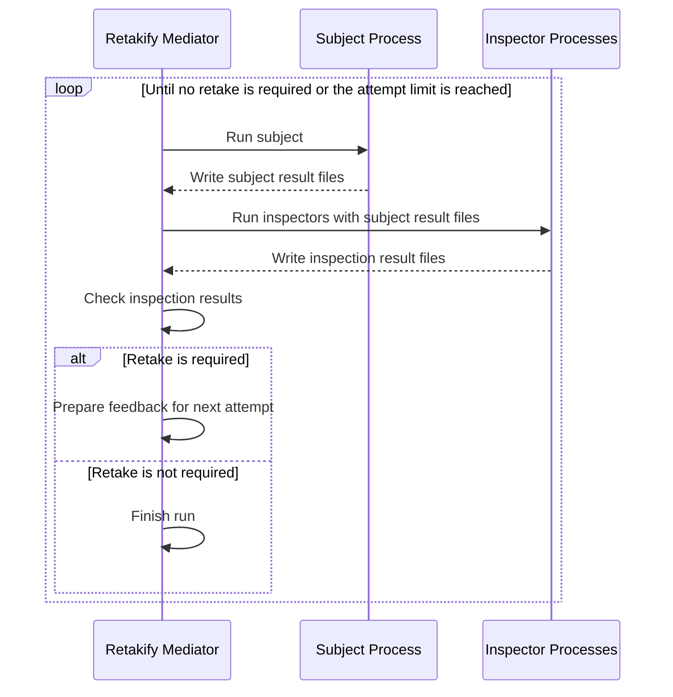
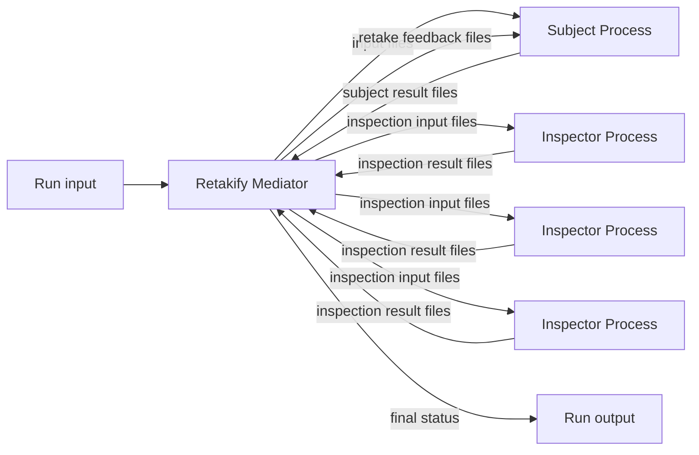

# Retakify Workflow

Retakify coordinates a file-based retake loop between one subject process and one or more inspector processes.

This document explains how Retakify lets those processes work together. It does not define file schemas, command formats, retake rule syntax, directory layouts, or implementation details.

## Overview

A Retakify workflow has three roles:

* the subject
* the inspectors
* the mediator

The subject performs the main work and writes result files.

Inspectors examine the subject's result files and write inspection result files.

Retakify acts as the mediator. It runs the subject, runs the inspectors, reads the inspection results, and decides whether the subject should be run again.

The subject and inspectors do not communicate directly. They cooperate only through files managed by Retakify.

## Basic Workflow

A typical Retakify run proceeds as follows:

1. Retakify starts a run.
2. Retakify runs the subject process.
3. The subject writes result files.
4. Retakify makes those result files available to the inspectors.
5. Retakify runs one or more inspector processes.
6. Each inspector writes inspection result files.
7. Retakify reads the inspection results.
8. If the inspection results do not require retake, the run finishes.
9. If retake is required, Retakify prepares feedback from the inspection results.
10. Retakify runs the subject again with that feedback.
11. The loop repeats until retake is no longer required or the configured attempt limit is reached.

In short:

```text
subject produces results
inspectors inspect results
Retakify decides whether to retake
subject runs again if needed
```

## Workflow Diagrams

### Sequence



### Data Flow



## First Attempt

The first subject attempt starts from the original input for the run.

At this stage, the subject does not receive inspection feedback because there are no previous inspection results yet.

The subject only needs to produce files that inspectors can examine.

## Inspection

After the subject finishes, Retakify runs the configured inspectors.

Each inspector receives the subject's result files through the file protocol. Inspectors may perform any kind of examination, such as review, validation, consistency checking, testing, or policy checking.

Retakify does not define how inspectors inspect the result. It only requires that inspectors write inspection result files that Retakify can read.

## Retake Decision

After all inspectors finish, Retakify checks their inspection results.

Inspectors report their findings. Retakify decides whether those findings require another subject attempt.

This keeps inspection and control separate:

```text
inspectors report
Retakify decides
subject retakes
```

An inspector does not rerun the subject directly. The subject does not call inspectors directly. Retakify mediates the whole loop.

## Retake Attempt

When retake is required, Retakify prepares feedback from the inspection results and passes it to the subject.

The subject then runs again. The new attempt produces new result files, and the inspectors examine those new files.

Each attempt is treated as a distinct step in the workflow. A later attempt does not erase the meaning of earlier attempts.

## Completion

A run completes when Retakify determines that no further retake is required.

A run may also stop when the configured attempt limit is reached.

In either case, Retakify should preserve the workflow history well enough to understand:

* what the subject produced
* what the inspectors reported
* why the loop continued or stopped

## Process Independence

Retakify does not require the subject or inspectors to be implemented in a specific way.

A process may be:

* an LLM-based coding agent
* a shell command
* a test runner wrapper
* a linter wrapper
* a document generator
* a review tool
* any other process that reads and writes files

Retakify only coordinates the workflow. It does not control the internal behavior of those processes.

## Workflow Boundary

Retakify is concerned with process cooperation, not with the details of the work itself.

Retakify does not decide:

* how the subject should implement a task
* how inspectors should evaluate the result
* which review methodology should be used
* which LLM, model, skill, plugin, or framework should be used
* how external tools should produce their internal judgments

Retakify only decides:

* when to run the subject
* when to run inspectors
* how to pass files between them
* when to continue or stop the retake loop

## Summary

Retakify workflow is a mediated cooperation loop:

```text
run subject
run inspectors
check inspection results
retake if needed
stop when no retake is required
```

The important point is that Retakify keeps processes loosely coupled.

The subject does not know the inspectors. Inspectors do not know how the subject works internally. Retakify connects them through files and controls the retake loop.
